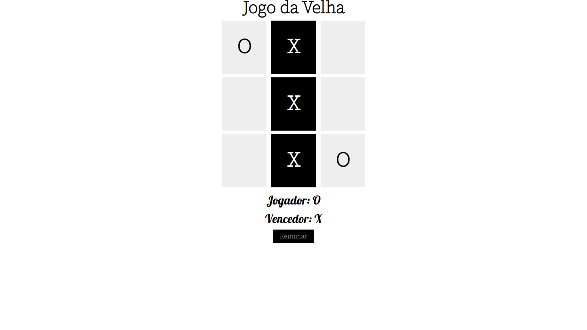

<h1 align="center" > jogoDaVelha <h1>

<h4>O Jogo da Velha é um projeto simples produzido para um bootcamp em parceria com a Digital Innovation One. Neste projeto, desenvolvi um jogo da velha utilizando HTML, CSS e Javascript. Para executar o projeto, basta apenas abrir o arquivo index.html em um navegador de seu preferência.<h4>

  

  <a href="https://github.com/Victor160197">
  
  

